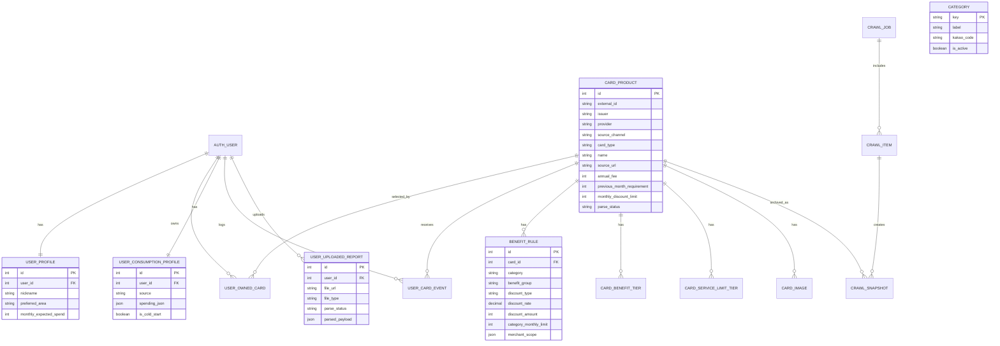

# SeulPick 제출 README

SeulPick은 사용자의 소비 내역, 현재 생활권, 카드 혜택 데이터를 함께 분석해 실제 생활 패턴에 맞는 카드를 추천하는 서비스입니다. 단순히 카드 혜택 문구를 나열하는 것이 아니라, 소비 카테고리와 주변 상권, 보유 카드, 추천 카드의 예상 절감액을 연결해 사용자가 왜 이 카드를 추천받는지 확인할 수 있도록 만드는 것을 목표로 했습니다.

## 1. 프로젝트 개요

| 항목 | 내용 |
| --- | --- |
| 프로젝트명 | 13-pjt / SeulPick |
| 서비스명 | SeulPick |
| 개발 형태 | Vue 3 + Vite 프론트엔드, Django REST 백엔드 |
| 주요 도메인 | 카드 추천, 소비 패턴 분석, 생활권 분석, 커뮤니티 |
| 배포 URL | https://vertoco.pythonanywhere.com |
| 주요 외부 API | Kakao Map API, YouTube Data API, GMS/Gemini VLM API |

## 2. 팀원 정보 및 업무 분담

| 역할 | 담당 업무 |
| --- | --- |
| 서울_6반_김초아 | 카드 데이터 수집 및 정규화, 금융 도메인 모델링, 추천 점수 계산, 생활권 분석 API, Graph DB 연계 구조 설계 |
| 서울_6반_이연주 | 프론트엔드 화면 구현, 소비 내역 업로드 및 VLM 분석 화면, 로그인/프로필 흐름, 커뮤니티 게시글/댓글/공감 UI 구현 |
| 서울_6반_김지윤 | A/B 영역 사이의 부족한 기능 보완, 프론트-백 API 연결, 발표 자료 구성, 배포 검증, 기능 흐름 통합 및 시연 준비 |

### 팀원별 세부 업무

#### 서울_6반_김초아

김초아 팀원은 서비스의 추천 근거가 되는 카드 데이터와 금융 도메인 구조를 담당했습니다. 카드 상품, 혜택 규칙, 월 한도, 연회비, 전월 실적 조건처럼 추천 계산에 필요한 데이터를 Django 모델로 분리하고, 카드 혜택 문구를 추천 가능한 형태로 정리했습니다. 또한 생활권 분석 결과가 추천 점수에 반영될 수 있도록 백엔드 API 구조를 설계하고, Graph DB를 활용해 카드-카테고리-지역 관계로 확장할 수 있는 방향을 정리했습니다.

#### 서울_6반_이연주

이연주 팀원은 사용자가 직접 마주하는 화면과 상호작용을 중심으로 구현했습니다. 홈 화면, 슬세권 분석, 카드 대시보드, 유튜브 검색, 커뮤니티, 프로필 화면을 구성하고, 각 화면에서 사용자가 자연스럽게 데이터를 입력하고 결과를 확인할 수 있도록 UI 흐름을 다듬었습니다. 특히 소비 내역 업로드 후 분석 상태가 명확히 보이도록 개선하고, 커뮤니티의 새 글 작성, 공감, 댓글 수정/삭제 같은 사용성 요소를 보완했습니다.

#### 서울_6반_김지윤

김지윤 팀원은 두 개발 영역 사이의 연결과 발표 준비를 맡았습니다. 프론트엔드가 기대하는 데이터 구조와 백엔드 API 응답이 어긋나는 부분을 찾아 수정하고, 배포 환경에서 API Key, 정적 파일, 데이터베이스 연결 상태를 점검했습니다. 또한 팀원이 만든 기능들이 하나의 서비스 흐름으로 이어지도록 시연 순서를 정리하고, 발표 자료와 제출 문서의 완성도를 높이는 역할을 수행했습니다.

## 3. 목표 서비스 및 실제 구현 정도

### 목표 서비스

1. 사용자가 소비 내역 또는 카드 명세 이미지를 업로드하면 AI가 소비 카테고리를 분석합니다.
2. 사용자가 지도에서 생활권을 선택하면 주변 카페, 편의점, 마트, 음식점/배달 상권을 조회합니다.
3. 소비 패턴과 생활권 데이터를 함께 반영해 카드 후보를 추천합니다.
4. 추천 이유, 예상 월 혜택, Seul-Score를 통해 추천 결과를 설명합니다.
5. 카드 정보, 영상 검색, 커뮤니티, 프로필을 한 서비스 안에서 확인합니다.

### 실제 구현 정도

| 기능 | 구현 정도 | 설명 |
| --- | --- | --- |
| 사용자 추천 | 구현 | 소비 카테고리, 위치 반경, 카드 혜택 규칙을 기반으로 추천 결과와 Seul-Score 표시 |
| API 활용 | 구현 | Kakao Map, YouTube, GMS/Gemini VLM API 연동 및 fallback 처리 |
| 커뮤니티 | 구현 | 게시글 작성, 최신글 상단 배치, 공감 UI, 댓글 작성/수정/삭제 구현 |
| RESTful 원칙 | 구현 | Django REST 기반으로 카드, 추천, 지도, 사용자, 커뮤니티 API 분리 |
| 서비스 배포 | 구현 | PythonAnywhere에 Django 백엔드 및 빌드된 프론트 정적 파일 배포 |
| API Key 관리 | 구현 | `.env`, `.env.example`, `.gitignore`로 실제 키와 예시 키 분리 |
| 대량 데이터 | 부분 구현 | SQLite 카드 데이터와 카드 혜택 규칙을 구축했으며, Graph DB 확장 구조를 설계 |
| 페이지 다양성 | 구현 | 홈, 슬세권 분석, 카드 대시보드, 유튜브 검색, 커뮤니티, 프로필 화면 구성 |

## 4. 데이터베이스 모델링 ERD

아래 ERD는 실제 Django 모델 기준으로 핵심 테이블을 정리한 것입니다. Django 기본 `User` 모델을 중심으로 사용자 프로필, 보유 카드, 소비 프로필, 업로드 리포트가 연결되고, 카드 상품은 혜택 규칙과 이미지, 구간별 한도 데이터를 가집니다.



커뮤니티 기능은 현재 제출 버전에서 Django view 내부 샘플 데이터와 API 상태를 활용해 동작합니다. 게시글 작성, 공감, 댓글 수정/삭제의 사용자 흐름을 우선 구현했으며, 추후 모델 기반 영속 저장 구조로 확장할 수 있습니다.

## 5. 추천 알고리즘 기술 설명

SeulPick의 추천은 `소비 데이터 -> 생활권 데이터 -> 카드 혜택 규칙 -> 설명 가능한 점수` 순서로 계산됩니다.

1. 소비 패턴 입력
   - 사용자가 이미지/PDF를 업로드하거나 기본 소비 유형을 선택합니다.
   - VLM 또는 로컬 파서가 소비 항목을 `cafe`, `convenience`, `mart`, `dining`, `delivery`, `shopping`, `transport`, `etc`로 정규화합니다.

2. 생활권 데이터 반영
   - Kakao Map API로 선택 위치 주변의 상권을 반경 100m, 200m, 400m 단위로 조회합니다.
   - 주변에 많은 카테고리는 사용 가능성이 높다고 보고 추천 가중치에 반영합니다.

3. 카드 혜택 규칙 매칭
   - `CardProduct`와 `BenefitRule`에 저장된 할인율, 정액 할인, 월 한도, 전월 실적, 카테고리 한도를 읽습니다.
   - 사용자 소비 금액과 혜택 조건을 비교해 예상 월 혜택을 계산합니다.

4. 보유 카드와 후보 카드 구분
   - `UserOwnedCard`로 보유 카드를 표시하고, 새 추천 카드와 비교할 수 있게 구성합니다.
   - 이미 보유한 카드와 추천 카드를 함께 보여 사용자가 교체 또는 추가 발급 여부를 판단할 수 있게 했습니다.

5. Seul-Score 계산
   - 예상 월 혜택, 소비 카테고리 적합도, 생활권 적합도, 전월 실적 부담, 연회비를 종합해 점수화합니다.
   - 최종 화면에서는 점수뿐 아니라 추천 근거 문장을 함께 보여 “왜 이 카드인지”를 설명합니다.

Graph DB는 카드, 카테고리, 사용자 이벤트, 지역 데이터를 관계로 확장하기 위한 설계와 동기화 구조를 마련했습니다. 제출 버전에서는 SQLite 기반 규칙 계산을 중심으로 동작하며, Neo4j는 관계 추천 고도화를 위한 확장 지점으로 정리했습니다.

## 6. 핵심 기능 설명

### 홈

서비스 콘셉트를 보여주는 첫 화면입니다. 카드 이미지를 활용한 움직이는 배경과 “카드는 많고, 혜택은 복잡하니까” 메시지로 서비스 방향을 전달합니다. 아래 단계형 섹션에서는 소비 패턴, 생활권, Graph DB 후보, Seul-Score, Try It 흐름을 설명합니다.

### 슬세권 분석

지도 또는 주소 검색으로 생활권을 선택하고 반경 100m, 200m, 400m 안의 상권 데이터를 확인합니다. 업로드한 소비 내역 분석 상태가 대기/분석 중/분석 완료로 명확히 보이도록 구성했습니다.

### 카드 대시보드

카드 데이터를 카드 종류별로 확인하고, 카드명, 카드사, 주요 혜택, 예상 혜택을 비교합니다. 카드 이미지는 외부 이미지 URL 또는 로컬 fallback을 통해 표시하도록 설계했습니다.

### 유튜브 검색

YouTube Data API를 활용해 카드 추천, 혜택 비교, 사용 후기 관련 영상을 조회합니다. API 키가 없거나 오류가 발생하면 예시 데이터로 fallback하여 화면이 깨지지 않게 했습니다.

### 커뮤니티

사용자가 카드 추천 후기, 질문, 생활권 정보를 게시글로 공유할 수 있습니다. 새 글은 목록 맨 위에 배치되며, 공감은 하트 아이콘 중심의 UI로 표현했습니다. 댓글은 작성뿐 아니라 수정과 삭제가 가능합니다.

### 프로필

닉네임, 선호 지역, 월 예상 소비, 보유 카드, 업로드 리포트를 관리합니다. 사용자 데이터는 추천 흐름과 연결되어 보유 카드 여부, 소비 프로필, 카드 이벤트를 저장하는 구조를 갖습니다.

## 7. 생성형 AI 활용 부분

서비스 기능 측면에서는 GMS/Gemini VLM API를 활용했습니다.

- 영수증 또는 카드 명세 이미지 업로드
- 이미지/PDF에서 소비 항목, 가맹점명, 금액 추출
- 추출 결과를 소비 카테고리로 정규화
- 분석 실패 시 로컬 파서 또는 샘플 결과로 fallback

개발 과정에서는 생성형 AI를 화면 문구 정리, README 초안 작성, 구현 흐름 점검, 오류 원인 추적에 활용했습니다. 단, 실제 API Key와 민감 정보는 `.env`로 분리해 저장소에 포함하지 않는 방식으로 관리했습니다.

## 8. API 및 실행 방법

### Backend

```bash
cd backend
python -m venv .venv
.venv\Scripts\activate
pip install -r requirements.txt
copy .env.example .env
python manage.py migrate
python manage.py runserver 127.0.0.1:8000
```

### Frontend

```bash
cd frontend
npm install
npm run dev -- --host 127.0.0.1 --port 5173
```

### 주요 API

| Method | Endpoint | 설명 |
| --- | --- | --- |
| GET | `/api/v1/health/` | 서버 및 주요 API 설정 상태 확인 |
| GET | `/api/v1/config/` | 프론트엔드에서 필요한 공개 설정 조회 |
| GET | `/api/v1/videos/` | YouTube 카드 관련 영상 검색 |
| GET | `/api/v1/finance/cards/` | 카드 목록 조회 |
| POST | `/api/v1/hyperlocal/parse-image/` | 이미지/PDF 소비 내역 분석 |
| GET | `/api/v1/hyperlocal/map-summary/` | 선택 위치 주변 상권 조회 |
| POST | `/api/v1/hyperlocal/simulate/` | 추천 카드 및 Seul-Score 계산 |
| GET/POST | `/api/v1/users/profile/` | 사용자 프로필 조회/저장 |

## 9. 단계별 구현 과정과 학습 내용

### 1단계: 요구사항 분석과 서비스 방향 결정

초기에는 카드 추천이라는 주제가 넓어서 단순 카드 목록 서비스가 되기 쉬웠습니다. 요구사항을 다시 확인하면서 “사용자의 소비 데이터와 생활권을 함께 읽는 추천 서비스”로 방향을 좁혔습니다. 이 과정에서 추천 결과 자체보다 추천 근거를 보여주는 것이 중요하다는 점을 배웠습니다.

### 2단계: 데이터 모델링

카드 데이터는 카드 상품, 혜택 규칙, 월 한도, 이미지, 크롤링 기록으로 나누어 설계했습니다. 처음에는 카드 하나에 혜택 문자열만 저장하려 했지만, 실제 추천 계산을 위해서는 카테고리, 할인 방식, 월 한도, 전월 실적 조건을 분리해야 했습니다. 이 과정에서 데이터 정규화가 추천 품질과 유지보수성에 직접 영향을 준다는 점을 느꼈습니다.

### 3단계: API 연동

Kakao Map, YouTube, GMS/Gemini API를 각각 연동했습니다. 외부 API는 키 누락, 할당량, 응답 형식 변경, 네트워크 오류가 언제든 발생할 수 있기 때문에 fallback 데이터와 상태 표시가 필요했습니다. 특히 배포 환경에서는 `.env` 설정 하나가 빠져도 화면이 정상적으로 보이지 않아, `/api/v1/health/`와 `/api/v1/config/`로 상태를 확인할 수 있게 만든 점이 도움이 되었습니다.

### 4단계: 프론트-백 연결

프론트에서 정적 샘플 데이터를 보여주는 것과 백엔드 API에서 받은 데이터를 실제로 렌더링하는 것은 차이가 컸습니다. 필드 이름, 이미지 URL, 카테고리 키, 날짜 형식이 조금만 달라도 화면이 깨질 수 있어 API 응답 구조를 반복해서 맞췄습니다. 개발자 C가 이 연결 지점을 집중적으로 확인하며 화면과 데이터의 간극을 줄였습니다.

### 5단계: 추천 알고리즘 고도화

단순 할인율이 높은 카드가 항상 좋은 카드는 아니었습니다. 전월 실적, 월 할인 한도, 사용 카테고리, 주변 상권 적합도를 함께 계산해야 실제 사용자에게 맞는 추천이 가능했습니다. 그래서 예상 월 혜택과 Seul-Score를 분리하고, 추천 카드 옆에 근거 문장을 함께 표시했습니다.

### 6단계: 배포와 제출 정리

PythonAnywhere 배포 과정에서 가상환경 경로, 정적 파일 매핑, npm 빌드 용량, 환경 변수 설정 문제가 있었습니다. 이 과정을 통해 로컬에서 잘 되는 서비스도 배포 환경에서는 파일 경로, 용량 제한, API 키, 정적 파일 경로를 모두 다시 확인해야 한다는 점을 배웠습니다.

## 10. 어려웠던 부분과 해결

| 어려웠던 점 | 해결 방법 |
| --- | --- |
| 카드 혜택 문구가 정형화되어 있지 않음 | 혜택 규칙을 별도 모델로 분리하고, 카테고리/할인 방식/한도 필드를 정규화 |
| 외부 API 키가 없을 때 화면이 깨짐 | health/config API와 fallback 데이터를 추가 |
| 지도 반경과 추천 결과가 따로 노는 문제 | 반경 선택 값을 추천 시뮬레이션 입력으로 연결 |
| 커뮤니티 최신글이 맨 아래에 추가됨 | 새 글 작성 시 배열 앞쪽에 삽입되도록 수정 |
| 배포 환경에서 npm 용량 문제가 발생 | 로컬 빌드 결과물을 배포하고 서버에서는 Django 정적 파일 중심으로 제공 |
| 카드 이미지가 배포 환경에서 보이지 않음 | 외부 image_url과 fallback 표시 구조를 점검하고, 정적/미디어 매핑을 분리 |

## 11. 제출 파일 구성

```text
seulpick/
  README.md
  .gitignore
  backend/
  frontend/
  seulpick_기획서.pdf
  제출파일정리/
    README.md
    제출_작업순서_체크리스트.md
    서비스실행화면캡쳐본/
```

서비스 실행 화면 캡쳐본은 사용자가 수동으로 준비한 `제출파일정리/서비스실행화면캡쳐본/` 폴더를 사용합니다. 이 README에서는 캡쳐 이미지를 새로 생성하지 않습니다.

## 12. GitLab 제출 순서

1. 팀원과 요구사항을 확인하고 GitLab에 `13-pjt` 프로젝트를 생성합니다.
2. 반 담당 강사님을 Maintainer로 설정합니다.
3. 팀원 간 branch, commit, merge 규칙을 정합니다.
4. 요구사항을 구현하고 기능별로 commit합니다.
5. `.gitignore`로 `.env`, DB, node_modules, 빌드 산출물 등 불필요한 파일을 제외합니다.
6. README와 제출 자료를 정리합니다.
7. 팀장 계정에서 GitLab 저장소에 Push합니다.
8. 나머지 팀원은 제출 시 해당 저장소를 Fork하거나 안내된 방식으로 제출합니다.

## 13. 이전 기획 및 설계 문서

프로젝트 초기에 작성한 기획과 설계 자료는 제출 루트에 함께 둔 `seulpick_기획서.pdf`를 기준으로 정리했습니다. 해당 문서에는 서비스 배경, 문제 정의, 주요 사용자 흐름, 화면 구성 방향, 추천 서비스의 핵심 가치가 포함되어 있습니다.

README에는 최종 구현 결과를 중심으로 다시 정리했고, 기획서와 README를 함께 보면 “처음에 어떤 서비스를 만들려고 했는지”와 “최종적으로 어떤 기능까지 구현했는지”를 비교할 수 있습니다.

## 14. 기타

이번 프로젝트를 통해 단순 CRUD 서비스와 추천 서비스의 차이를 체감했습니다. 추천 서비스는 “무엇을 보여줄 것인가”보다 “왜 그렇게 추천했는가”를 설명하는 구조가 중요했습니다. 또한 API 연동, 배포, 문서화까지 포함해야 실제 사용자에게 전달 가능한 서비스가 된다는 점을 배웠습니다.

