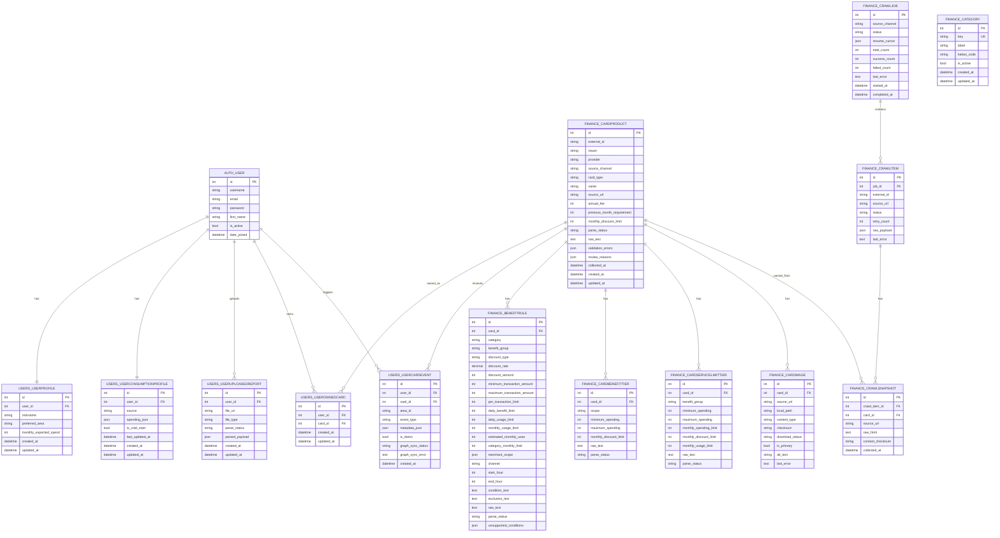
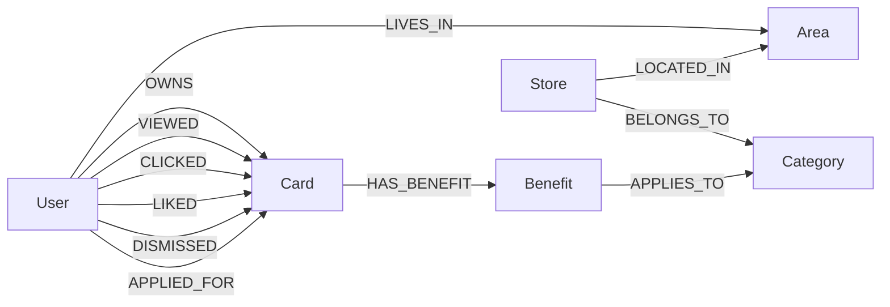

# Database ERD

이 문서는 현재 SeulPick 백엔드에서 사용하는 저장소 구조를 정리한다.

저장소는 두 개로 나뉜다.

```text
SQLite / Django DB
- 사용자, VLM 결과, 카드 원천 데이터, 카드 혜택, 사용자 행동 로그 저장
- Python 추천 코어가 계산에 사용하는 기준 데이터

Neo4j Graph DB
- 지역, 상점, 카테고리, 카드 혜택, 사용자 행동 관계 저장
- 지역 기반 후보 카드 탐색과 행동 기반 확장에 사용
```

## SQLite / Django DB ERD

현재 Django 모델 기준 핵심 ERD는 다음과 같다.



## SQLite 테이블 역할

### 사용자 영역

```text
auth_user
- 로그인 계정 기준 테이블

users_userprofile
- 프로필 화면 표시 정보
- 선호 지역, 예상 월 소비액 저장

users_userconsumptionprofile
- VLM 또는 사용자 입력에서 추출된 소비 패턴 저장
- 추천 코어의 spending 입력값으로 사용

users_useruploadedreport
- VLM 업로드 결과와 파싱 결과 저장
- parsed_payload.spending이 소비 프로필로 연결됨

users_userownedcard
- 사용자가 이미 보유한 카드 저장
- 추천 결과에서 보유 카드 표시 및 Graph DB OWNS 관계에 사용

users_usercardevent
- 카드 조회, 클릭, 찜, 발급신청, 제외 행동 저장
- 지역 인기카드와 Graph DB 행동 관계의 기준 데이터
```

### 카드/혜택 영역

```text
finance_cardproduct
- 카드 상품의 기준 테이블
- 추천 후보의 source of truth

finance_benefitrule
- 카드별 혜택 규칙
- 카테고리, 할인율, 할인금액, 한도, 조건 저장
- Python 추천 코어의 혜택 계산 기준

finance_cardbenefittier
- 전월 실적 구간별 카드 전체 한도

finance_cardservicelimittier
- 혜택 그룹별 월 한도/사용 횟수/구간 조건

finance_cardimage
- 카드 이미지 정보

finance_category
- 서비스 카테고리 기준값
- Kakao category code와 매핑 가능
```

### 카드 수집 영역

```text
finance_crawljob
- 카드 수집 작업 단위

finance_crawlitem
- 수집 대상 URL 또는 외부 카드 항목

finance_crawlsnapshot
- 수집 당시 원문 HTML과 카드 정규화 결과 연결
```

## 추천 로직에서 SQLite가 하는 일

```text
1. 사용자 소비 패턴 조회
   users_userconsumptionprofile.spending_json

2. 카드 후보 기준 데이터 조회
   finance_cardproduct
   finance_benefitrule
   finance_cardbenefittier
   finance_cardservicelimittier

3. Python 추천 코어 계산
   estimated_gross_benefit
   estimated_net_value
   ranking_score
   seul_score

4. 사용자 행동 로그 저장
   users_usercardevent

5. 지역 인기카드 계산
   현재 지역 추천 후보 중 users_usercardevent의 viewed/liked/applied_for를 집계
```

## Neo4j Graph DB 구조

Neo4j는 SQL 테이블이 아니라 노드와 관계로 구성된다.



## Neo4j 노드

```text
User
- id
- nickname
- updated_at

Area
- id
- name
- updated_at

Store
- id
- name
- updated_at

Category
- key
- updated_at

Card
- key
- name
- issuer
- provider
- card_type
- annual_fee
- previous_month_requirement
- monthly_discount_limit
- source_url
- image_url
- updated_at

Benefit
- key
- discount_type
- benefit_group
- discount_rate
- discount_amount
- minimum_transaction_amount
- maximum_transaction_amount
- per_transaction_limit
- daily_benefit_limit
- daily_usage_limit
- monthly_usage_limit
- estimated_monthly_uses
- category_monthly_limit
- merchant_scope
- channel
- start_hour
- end_hour
- updated_at
```

## Neo4j Relationships

```text
(User)-[:LIVES_IN]->(Area)
- 사용자의 선호/거주 지역

(User)-[:OWNS]->(Card)
- 사용자가 보유한 카드

(User)-[:VIEWED]->(Card)
- 카드 상세 조회

(User)-[:CLICKED]->(Card)
- 카드 클릭

(User)-[:LIKED]->(Card)
- 찜

(User)-[:DISMISSED]->(Card)
- 추천 제외 또는 관심 없음

(User)-[:APPLIED_FOR]->(Card)
- 발급신청 버튼 클릭

(Store)-[:LOCATED_IN]->(Area)
- 상점이 특정 지역 반경에 포함됨

(Store)-[:BELONGS_TO]->(Category)
- 상점의 업종 카테고리

(Card)-[:HAS_BENEFIT]->(Benefit)
- 카드가 혜택을 보유함

(Benefit)-[:APPLIES_TO]->(Category)
- 혜택이 특정 소비 카테고리에 적용됨
```

## Graph DB 추천 후보 탐색 경로

현재 추천 후보 생성에서 실제로 사용하는 핵심 경로는 다음과 같다.

```text
Area
  <- LOCATED_IN - Store
  - BELONGS_TO -> Category
  <- APPLIES_TO - Benefit
  <- HAS_BENEFIT - Card
```

의미:

```text
선택한 지역
-> 그 지역 주변 상점
-> 상점들의 업종 카테고리
-> 해당 카테고리에 적용되는 카드 혜택
-> 해당 혜택을 가진 카드
```

현재 코드 기준 핵심 Cypher 패턴:

```cypher
MATCH (a:Area {id: $area_id})<-[:LOCATED_IN]-(area_store:Store)
WITH a, count(area_store) AS area_store_count
MATCH (a)<-[:LOCATED_IN]-(s:Store)-[:BELONGS_TO]->(cat:Category)
WITH a, area_store_count, cat, count(s) AS nearby_store_count
MATCH (card:Card)-[:HAS_BENEFIT]->(b:Benefit)-[:APPLIES_TO]->(cat)
RETURN
    card.key AS card_key,
    cat.key AS category_key,
    nearby_store_count,
    area_store_count
```

## SQLite와 Neo4j의 연결 기준

SQLite와 Neo4j는 같은 카드 데이터를 다음 키로 연결한다.

```text
SQLite CardProduct:
source_channel
external_id

Neo4j Card:
key = seulpick:{source_channel}:{external_id}
```

예:

```text
seulpick:card_gorilla:12345
```

사용자 연결은 Django user id를 문자열로 사용한다.

```text
SQLite auth_user.id
-> Neo4j User.id
```

지역 연결은 `area_id` 문자열을 사용한다.

```text
SQLite users_usercardevent.area_id
-> Neo4j Area.id
-> 추천 요청 payload.area_id
```

## 책임 분리

```text
SQLite / Django DB
- 정합성이 중요한 기준 데이터 저장
- 카드 약관과 혜택 계산에 필요한 원천 데이터
- 사용자/VLM/행동 로그의 source of truth

Neo4j Graph DB
- 지역 상권, 카드 혜택, 사용자 행동의 관계 탐색
- 지역 기반 후보 카드 생성
- 지역 인기카드, 유사 사용자 추천, 개인화 추천으로 확장
```

중요한 원칙:

```text
최종 혜택 금액과 점수 계산은 Python 추천 코어가 수행한다.
Graph DB는 후보 생성과 관계 신호를 제공한다.
```
