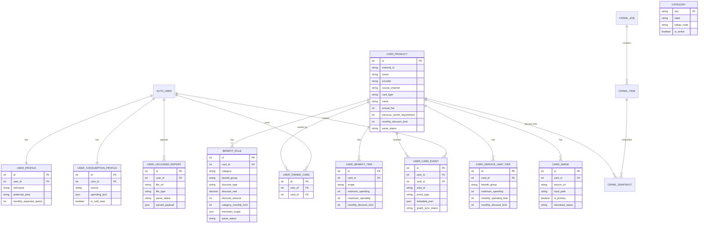

# SeulPick 제출 문서

## 1. 프로젝트 개요

SeulPick은 사용자의 소비 내역, 현재 생활권, 주변 상권 데이터, 카드 혜택 약관을 함께 분석해 실제로 쓸 가능성이 높은 카드를 추천하는 Vue 3 + Django REST 기반 서비스입니다.

단순히 할인율이 높은 카드를 보여주는 방식이 아니라, 사용자가 어느 지역에서 어떤 카테고리에 돈을 쓰는지, 선택한 위치 주변에 어떤 업종과 브랜드가 분포하는지, 카드별 전월 실적·월 한도·연회비 조건이 실제 혜택에 어떤 영향을 주는지를 함께 계산하는 것을 목표로 했습니다.

제출 폴더 구성은 다음과 같습니다.

```text
submission/
  README.md                    제출용 상세 설명 문서
  source-code/
    backend/                   Django REST 백엔드 소스
    frontend/                  Vue 3 + Vite 프론트엔드 소스
  item3_source_screenshots/    3번 제출 항목: 문제별 소스 위치 및 실행 화면 캡처
```

보안상 로컬 실행 파일과 비밀값은 제출 폴더에서 제외했습니다.

- 제외: `backend/.env`, `frontend/.env.local`, `backend/db.sqlite3`, `node_modules`, `dist`, 로그 파일, 미디어 저장소
- 포함: `.env.example`, 실행 소스, 문서, 화면 캡처

## 2. 팀원 정보 및 업무 분담 내역

프로젝트 문서 기준 업무 분담은 개발자 A/B/C 3명 구조로 나누었습니다.

| 구분 | 담당 영역 | 주요 산출물 |
| --- | --- | --- |
| 개발자 A | 하이퍼로컬 인프라, 지도 데이터, 날씨/지역 데이터, 카드 데이터 파이프라인, Graph DB 추천 데이터, Seul-Score 시뮬레이션 | `backend/hyperlocal/`, `backend/finance/`, 추천 알고리즘, 카드 카탈로그 API, Neo4j 연동 계획 및 fallback |
| 개발자 B | 멀티모달 이미지 파싱, 인증, 커뮤니티, 게시글 검열, 프로필 흐름 | `backend/users/`, `backend/community/`, 프론트 업로드/로그인/커뮤니티/프로필 UI |
| 개발자 C | 개발자 A/B 사이의 부족한 부분 보완, API 계약 연결, 프론트-백엔드 통합, 발표 자료 및 시연 흐름 정리 | API 연결 조율, 화면 흐름 정리, 발표/시연 준비, 통합 테스트 보조 |
| 공통 | 백엔드 API 계약 소비, 프론트 UI 통합, 실행 화면 구성 | `frontend/src/App.vue`, `frontend/src/api.js`, `frontend/src/style.css` |

실제 제출 소스는 전체 통합본이며, 프론트는 별도 데이터 구조를 만들기보다 백엔드 API 계약을 소비하는 방향으로 구성했습니다.

## 3. 목표 서비스 및 실제 구현 정도

### 목표 서비스

1. 사용자가 지도에서 생활권 위치와 반경을 선택한다.
2. Kakao Map 기반 주변 상권 데이터를 수집하고 카테고리별 신호로 정규화한다.
3. 이미지 또는 PDF로 소비 내역을 업로드하면 VLM 또는 로컬 파서가 카테고리별 소비액을 추출한다.
4. 카드 상품, 혜택 규칙, 연회비, 전월 실적, 월 한도를 반영해 예상 순혜택을 계산한다.
5. Graph DB 후보 탐색과 Python 추천 코어를 결합해 설명 가능한 Seul-Score를 만든다.
6. 사용자는 카드 추천 결과, 유튜브 검색, 커뮤니티, 프로필/보유 카드 흐름을 이용한다.

### 실제 구현 정도

| 기능 | 구현 정도 | 비고 |
| --- | --- | --- |
| Vue 홈/서비스 소개 화면 | 완료 | `service-intro.html` 참고 그라데이션, 단계형 시뮬레이터 반영 |
| Kakao Map 생활권 선택 | 완료 | 지도 클릭/주소 검색/반경 변경 UI, 주변 장소 표시 |
| 소비 내역 이미지/PDF 업로드 | 완료 | VLM 호출 경로 + PDF 로컬 파서 fallback |
| 소비 카테고리 정규화 | 완료 | `cafe`, `convenience`, `mart`, `dining`, `delivery`, `shopping`, `transport`, `etc` |
| 카드 상품/혜택 데이터 모델 | 완료 | `CardProduct`, `BenefitRule`, `CardImage`, tier 모델 |
| 추천 알고리즘 | 완료 | 순혜택, 지역 적합도, 카테고리 적합도, Seul-Score |
| Graph DB 연동 설계 및 후보 fallback | 부분 완료 | Neo4j 후보 탐색 구조 및 repository/fallback 구현, 로컬 미설정 시 SQLite fallback |
| 인증/프로필/보유 카드 | 완료 | 로그인/회원가입/프로필 수정/보유 카드 추가 |
| 커뮤니티 | 완료 | 글 작성, 최신 글 상단 노출, 공감, 댓글 작성/수정/삭제 |
| 유튜브 검색 | 완료 | API 설정 시 검색, 미설정 시 fallback |
| 배포 | 미실시 | 로컬 실행 기준 제출 |

## 4. 데이터베이스 모델링 ERD

아래 ERD는 Django 모델 기준 핵심 테이블 관계를 정리한 것입니다.



커뮤니티는 현재 제출 구현에서 인메모리 API로 동작합니다. 핵심 CRUD 흐름은 `backend/community/views.py`에 구현되어 있으며, 게시글/댓글은 API 응답 객체로 관리됩니다.

## 5. 추천 알고리즘 기술 설명

추천 알고리즘은 `backend/finance/recommendation.py`를 기준으로 구현했습니다. 핵심 원칙은 카드사의 발급 유도보다 사용자 입장에서의 월 예상 순혜택과 실제 사용 가능성을 우선하는 것입니다.

### 5.1 카드 혜택 계산

카드별 혜택은 카테고리 소비액과 혜택 규칙을 비교해 계산합니다.

```text
거래 혜택 = min(거래 금액 × 할인율, 건당 할인 한도)
카테고리 혜택 = min(적격 거래 혜택 합계, 카테고리 월 한도)
월 예상 총혜택 = min(카테고리 혜택 합계, 카드 월 통합 할인 한도)
월 예상 순혜택 = 월 예상 총혜택 - 연회비 / 12
```

전월 실적을 충족하지 못하면 할인 혜택은 0원으로 계산하지만, 연회비 월 환산액은 비용으로 계속 반영합니다. 이 때문에 혜택률만 높은 카드가 아니라 실제 순이익이 큰 카드가 상위에 오릅니다.

### 5.2 지역 적합도

생활권 데이터는 예상 할인액 자체를 바꾸지 않고, 해당 혜택을 실제로 사용할 가능성을 나타내는 별도 점수로 사용합니다.

```text
category_share = category_store_count / total_store_count
density_score = min(log(1 + category_store_count) / log(1 + 50), 1)
local_accessibility = 0.6 × category_share + 0.4 × density_score
```

카카오 지도에서 수집한 장소명은 브랜드명으로 정규화하고, 카드 혜택의 `merchant_scope`와 비교해 브랜드 접근성도 계산합니다.

```text
merchant_accessibility = 혜택 대상 브랜드 매장 수 / 수집한 카테고리 장소 수
```

### 5.3 추천 모드

전체 추천에서는 사용자의 전체 소비 패턴을 기준으로 정렬합니다.

```text
overall_ranking_score
= 0.60 × normalized_net_value
  + 0.25 × spending_benefit_fit
  + 0.15 × local_brand_fit
```

특정 카테고리를 선택한 경우에는 해당 카테고리의 소비액, 혜택 규칙, 주변 브랜드와 업종 밀집도만 사용합니다.

```text
category_ranking_score = selected_category_fit_score
```

### 5.4 공통 정렬 기준

1. 전월 실적 충족 여부
2. 추천 계산 가능 여부
3. `ranking_score`
4. `local_fit_score`
5. `estimated_net_value`
6. `estimated_gross_benefit`

`seul_score`는 현재 선택된 추천 모드의 `ranking_score`와 동일하게 반환합니다.

### 5.5 Neo4j Graph DB 활용

SQLite는 기준 저장소이고 Neo4j는 추천 후보 탐색용 파생 저장소입니다.

```text
SQLite active 카드/혜택
  -> Neo4j Card-Benefit-Category 관계 동기화
  -> Area-Store-Category-Card 후보 조회
  -> Python 추천 코어에서 최종 정산
```

Neo4j가 실패하거나 후보가 없으면 SQLite 후보 조회로 fallback합니다. 따라서 Graph DB는 추천 성능과 후보 탐색을 보조하지만, 최종 금액 계산과 설명 가능성은 Python 코드가 책임집니다.

## 6. 핵심 기능 설명

### 6.1 홈 단계형 시뮬레이터

홈 화면은 SeulPick 추천 흐름을 `소비 패턴 -> 생활권 -> Graph DB -> Seul-Score` 단계로 보여줍니다. 사용자가 소비 유형, 지역, 반경을 바꾸면 추천 카드, 후보 수, 점수가 즉시 변합니다.

관련 소스:

- `source-code/frontend/src/App.vue`
- `source-code/frontend/src/style.css`

### 6.2 슬세권 분석

지도에서 위치를 선택하거나 주소를 검색하고, 반경을 조절해 주변 장소 데이터를 확인합니다. 사용자는 선택한 지역 데이터를 추천 계산에 적용할 수 있습니다.

관련 소스:

- `source-code/frontend/src/App.vue`
- `source-code/backend/hyperlocal/views.py`
- `source-code/backend/hyperlocal/services.py`

### 6.3 소비 내역 자동 분석

사용자가 이미지 또는 PDF를 업로드하면 백엔드가 VLM 또는 로컬 파서를 통해 소비 카테고리별 금액을 추출합니다. 분석 완료 후 프론트는 `분석 완료` 상태를 명확히 보여주고 추천 재계산에 사용할 수 있게 합니다.

관련 소스:

- `source-code/backend/hyperlocal/views.py`
- `source-code/backend/users/views.py`
- `source-code/frontend/src/api.js`
- `source-code/frontend/src/App.vue`

### 6.4 카드 추천 대시보드

카드 이미지, 예상 혜택, Seul-Score, 상세 혜택 조건을 보여줍니다. 사용자는 카드 상세 drawer에서 혜택 조건을 확인하고 찜할 수 있습니다.

관련 소스:

- `source-code/backend/finance/models.py`
- `source-code/backend/finance/recommendation.py`
- `source-code/backend/finance/views.py`
- `source-code/frontend/src/App.vue`

### 6.5 커뮤니티

게시글 작성 시 최신 글이 목록 최상단에 노출됩니다. 공감은 하트 형태 UI로 제공되며 서버 API에 반영됩니다. 댓글은 작성, 수정, 삭제가 가능합니다.

관련 소스:

- `source-code/backend/community/views.py`
- `source-code/backend/community/urls.py`
- `source-code/frontend/src/App.vue`
- `source-code/frontend/src/api.js`

### 6.6 프로필 및 보유 카드

로그인 사용자는 프로필 정보를 수정하고, 보유 카드를 등록할 수 있습니다. 추천 결과에서는 보유 카드 여부를 표시할 수 있는 계약을 둡니다.

관련 소스:

- `source-code/backend/users/models.py`
- `source-code/backend/users/views.py`
- `source-code/frontend/src/App.vue`

## 7. 생성형 AI 활용 부분

프로젝트에서 생성형 AI는 크게 두 가지 방향으로 활용했습니다.

### 7.1 소비 내역 이미지/PDF 분석

가계부 캡처, 카드 명세서 이미지, PDF 명세서를 업로드하면 VLM이 거래 내용을 읽고 다음 구조로 정규화합니다.

```json
{
  "spending": {
    "cafe": 102000,
    "convenience": 58000,
    "mart": 89000,
    "dining": 183000,
    "shopping": 44000,
    "transport": 36000,
    "etc": 0
  }
}
```

외부 VLM 설정이 없거나 실패하면 로컬 샘플 파서 또는 PDF 텍스트 파서를 통해 fallback합니다. 운영용 API 키는 코드에 하드코딩하지 않고 환경변수로만 관리합니다.

관련 환경변수:

```text
GMS_KEY
VLM_API_KEY
VLM_API_URL
VLM_MODEL
VLM_API_TYPE
```

### 7.2 개발 및 문서화 보조

기능 구현 과정에서 생성형 AI를 코드 탐색, UI 문구 개선, 제출 문서 구성, README 정리, 실행 흐름 점검에 활용했습니다. 단, 실제 서비스 동작은 테스트 가능한 Django/Vue 코드와 명시적 fallback 경로를 기준으로 유지했습니다.

## 8. 배포 URL

현재 제출본은 로컬 실행 기준입니다. 별도 배포 URL은 없습니다.

로컬 실행 주소:

```text
Frontend: http://127.0.0.1:5173
Backend:  http://127.0.0.1:8000
```

## 9. 실행 방법

### 9.1 백엔드

```bash
cd submission/source-code/backend
pip install -r requirements.txt
python manage.py migrate
python manage.py runserver 127.0.0.1:8000
```

백엔드 환경변수는 `backend/.env.example`을 참고해 `backend/.env`로 구성합니다.

### 9.2 프론트엔드

```bash
cd submission/source-code/frontend
npm install
npm run dev -- --host 127.0.0.1 --port 5173
```

프론트 환경변수 예시는 다음과 같습니다.

```dotenv
VITE_API_BASE=http://127.0.0.1:8000/api/v1
VITE_API_BASE_URL=http://127.0.0.1:8000/api/v1
VITE_BACKEND_ORIGIN=http://127.0.0.1:8000
VITE_KAKAO_JAVASCRIPT_KEY=your-kakao-js-key
```

## 10. 구현 과정에서 학습한 내용, 어려웠던 부분, 새로 배운 것

### 10.1 1단계: 백엔드 API 계약 정리

초기에는 프론트가 보여주고 싶은 화면과 백엔드가 실제로 제공할 수 있는 데이터 구조 사이에 간극이 있었습니다. 이 문제를 줄이기 위해 먼저 백엔드 API 계약을 기준으로 삼고, 프론트는 별도 임의 구조를 만들지 않고 API 응답을 소비하는 방향으로 정리했습니다.

학습한 점:

- API 계약이 먼저 정리되어야 프론트와 백엔드 작업이 충돌하지 않는다.
- 소비 카테고리 key를 `cafe`, `mart`, `delivery`처럼 고정해야 추천 알고리즘과 UI가 안정적으로 연결된다.
- 외부 API 실패를 고려한 fallback 응답 구조가 있어야 로컬 개발과 시연이 끊기지 않는다.

어려웠던 부분:

- 이미지/PDF 분석 결과, 지도 상권 데이터, 카드 혜택 약관의 단위가 모두 달라 한 번에 비교하기 어려웠다.
- 특히 카드 혜택 약관은 전월 실적, 월 한도, 건별 한도, 특정 가맹점 조건이 섞여 있어 단순 할인율 비교로는 추천 품질이 떨어졌다.

### 10.2 2단계: 카드 데이터 모델링

카드 상품을 단순한 이름/혜택 문자열로 저장하지 않고, `CardProduct`, `BenefitRule`, `CardBenefitTier`, `CardServiceLimitTier`, `CardImage`로 나누었습니다. 이렇게 나누면서 추천 계산, 이미지 렌더링, 데이터 검증을 분리할 수 있었습니다.

학습한 점:

- 카드 혜택은 카드 단위가 아니라 혜택 규칙 단위로 쪼개야 계산 가능하다.
- `parse_status`를 두면 수집 데이터가 곧바로 추천에 들어가는 것을 막을 수 있다.
- 이미지도 카드 모델 안에 문자열 하나로 넣기보다 별도 모델로 두면 primary 이미지, 다운로드 상태, fallback 처리가 쉬워진다.

어려웠던 부분:

- 실제 카드 약관은 표현이 다양해서 모든 조건을 완벽히 정규화하기 어렵다.
- 추천 가능한 데이터와 검토가 필요한 데이터를 분리하는 기준이 필요했다.

### 10.3 3단계: 추천 알고리즘 구현

추천 알고리즘은 예상 순혜택을 기준으로 하되, 생활권에서 실제로 쓸 수 있는 혜택인지도 반영하도록 설계했습니다.

학습한 점:

- 예상 혜택 금액과 지역 적합도는 서로 다른 의미의 지표이므로 섞기 전에 역할을 분리해야 한다.
- 지역 매장 수가 많다고 실제 할인액이 늘어나는 것은 아니므로, 지역 데이터는 금액이 아니라 점수/정렬 신호로 써야 한다.
- 설명 가능한 추천을 위해 계산 중간값을 API 응답에 포함하는 것이 중요하다.

어려웠던 부분:

- 전월 실적을 충족하지 못하는 카드의 점수 처리.
- 연회비 월 환산액을 순혜택에 반영하는 방식.
- 특정 가맹점 전용 혜택을 소비 상세가 없을 때 어떻게 처리할지 결정하는 것.

### 10.4 4단계: VLM 및 PDF 분석

이미지 기반 소비 분석은 외부 VLM 호출 결과가 항상 안정적이지 않다는 점이 가장 큰 어려움이었습니다. 따라서 VLM 호출 경로와 로컬 PDF 텍스트 파서를 함께 두었습니다.

학습한 점:

- 생성형 AI 응답은 반드시 JSON 파싱, key 검증, fallback이 필요하다.
- PDF 명세서는 텍스트 추출이 가능한 경우 VLM 없이도 안정적인 결과를 만들 수 있다.
- AI 분석 상태는 UI에서 `분석 중`, `추천 계산 중`, `분석 완료`처럼 명확히 보여줘야 사용자가 흐름을 이해한다.

어려웠던 부분:

- GMS/Gemini proxy가 이미지 payload를 처리하는 방식이 환경마다 달라 디버깅이 필요했다.
- VLM이 잘못된 카테고리나 금액을 반환할 가능성을 고려해야 했다.

### 10.5 5단계: 프론트 UI 통합

프론트는 홈, 지도, 카드 대시보드, 유튜브 검색, 커뮤니티, 프로필을 하나의 SPA로 구성했습니다. 사용자가 추천 흐름을 이해할 수 있도록 홈에 단계형 시뮬레이터를 만들고, 실제 분석 페이지에서는 지도와 소비 내역 분석을 나란히 배치했습니다.

학습한 점:

- 추천 서비스는 결과만 보여주기보다 왜 추천됐는지 설명하는 화면이 중요하다.
- 로딩/완료/실패 상태를 명확히 표시해야 사용자가 분석 과정을 신뢰한다.
- 커뮤니티처럼 간단해 보이는 기능도 글 작성 후 위치, 공감 동기화, 댓글 수정/삭제 같은 세부 상호작용이 필요하다.

어려웠던 부분:

- 지도 UI, 업로드 UI, 카드 추천 UI를 한 화면에서 과하지 않게 배치하는 것.
- 포트와 프록시 설정이 바뀔 때 프론트와 백엔드 연결이 끊기지 않도록 `.env.local`과 Vite proxy를 맞추는 것.

### 10.6 6단계: 제출 정리

제출 폴더를 만들면서 소스 전체를 넣되, 실행에 불필요하거나 보안상 포함하면 안 되는 파일을 제외했습니다.

학습한 점:

- 제출물에는 실행 가능한 소스와 설명 문서뿐 아니라, 어떤 파일을 제외했는지도 명확히 적는 것이 좋다.
- README는 단순 실행 방법보다 구현 의도, 실제 구현 범위, 아쉬운 점, 개선 방향까지 담아야 평가자가 프로젝트 맥락을 이해하기 쉽다.

## 11. 실행 화면 캡처본

캡처 파일은 `submission/item3_source_screenshots/screenshots/`에 포함했습니다.

| 화면 | 파일 |
| --- | --- |
| 홈 히어로 | `item3_source_screenshots/screenshots/1-1_home_hero.png` |
| 홈 단계형 시뮬레이터 | `item3_source_screenshots/screenshots/1-2_home_simulator.png` |
| 홈 서비스 플로우 | `item3_source_screenshots/screenshots/1-3_home_service_flow.png` |
| 지도 + AI 소비 분석 | `item3_source_screenshots/screenshots/2-1_map_location_ai.png` |
| 지도 추천 리포트 | `item3_source_screenshots/screenshots/2-2_map_recommendation_report.png` |
| 지도 반경 변경 | `item3_source_screenshots/screenshots/2-3_map_radius_change.png` |
| 카드 추천 대시보드 | `item3_source_screenshots/screenshots/3-1_cards_dashboard.png` |
| 카드 상세 drawer | `item3_source_screenshots/screenshots/3-2_card_detail_drawer.png` |
| 유튜브 검색 | `item3_source_screenshots/screenshots/4-1_youtube_search.png` |
| 커뮤니티 목록/공감 | `item3_source_screenshots/screenshots/5-1_community_list.png` |
| 커뮤니티 게시글/댓글 | `item3_source_screenshots/screenshots/5-2_community_post_detail_comments.png` |
| 커뮤니티 글쓰기 | `item3_source_screenshots/screenshots/5-3_community_write.png` |
| 프로필 개요 | `item3_source_screenshots/screenshots/6-1_profile_overview.png` |
| 프로필 보유카드 추가 | `item3_source_screenshots/screenshots/6-2_profile_owned_card_picker.png` |
| 프로필 수정 | `item3_source_screenshots/screenshots/6-3_profile_edit.png` |

## 12. 완성 소스코드 위치

| 구분 | 경로 | 설명 |
| --- | --- | --- |
| 백엔드 전체 | `source-code/backend/` | Django REST API, 추천 알고리즘, 모델, 커뮤니티, 유저 기능 |
| 프론트 전체 | `source-code/frontend/` | Vue 3 SPA, 홈/지도/추천/커뮤니티/프로필 UI |
| 카드 추천 알고리즘 | `source-code/backend/finance/recommendation.py` | 순혜택, Seul-Score, 지역 적합도 계산 |
| 카드 데이터 모델 | `source-code/backend/finance/models.py` | 카드, 혜택 규칙, 이미지, 수집 모델 |
| 지도/소비 분석 API | `source-code/backend/hyperlocal/` | 지도 요약, 이미지/PDF 분석, 시뮬레이션 |
| 사용자/프로필 API | `source-code/backend/users/` | 인증, 프로필, 보유 카드, 업로드 리포트 |
| 커뮤니티 API | `source-code/backend/community/` | 게시글, 공감, 댓글 작성/수정/삭제 |
| 프론트 API 클라이언트 | `source-code/frontend/src/api.js` | 백엔드 API 호출 모음 |
| 프론트 메인 화면 | `source-code/frontend/src/App.vue` | SPA 화면/상태/상호작용 |
| 프론트 스타일 | `source-code/frontend/src/style.css` | 전체 UI 스타일 |

## 13. 검증 명령

개발 중 확인한 주요 검증 명령입니다.

```bash
cd backend
python manage.py check
python manage.py test hyperlocal.tests.VlmConsumptionParserTests
python manage.py test finance.test_card_catalog.CardCatalogTests finance.test_views.CardProductListApiTests
```

```bash
cd frontend
npm.cmd run build
```

현재 제출 직전에도 다음 검증을 통과했습니다.

- Django system check 통과
- Vite production build 통과

## 14. 아쉬운 점 및 향후 개선 방향

1. 커뮤니티는 현재 인메모리 API 중심이므로 실제 서비스에서는 DB 모델로 영속화해야 합니다.
2. Neo4j는 후보 탐색/fallback 구조를 갖추었지만, 배포 환경에서 Graph DB를 항상 실행하는 구성은 추가 작업이 필요합니다.
3. VLM 분석은 fallback이 있으나 실제 카드 명세서 형식이 다양하므로 더 많은 샘플 기반 검증이 필요합니다.
4. 프론트 번들 크기가 커서 추후 라우트 단위 code splitting을 적용할 수 있습니다.
5. 추천 알고리즘은 설명 가능성을 우선했기 때문에, 사용자 행동 로그가 충분히 쌓이면 협업 필터링 또는 GDS 유사 사용자 신호를 제한적으로 추가할 수 있습니다.
